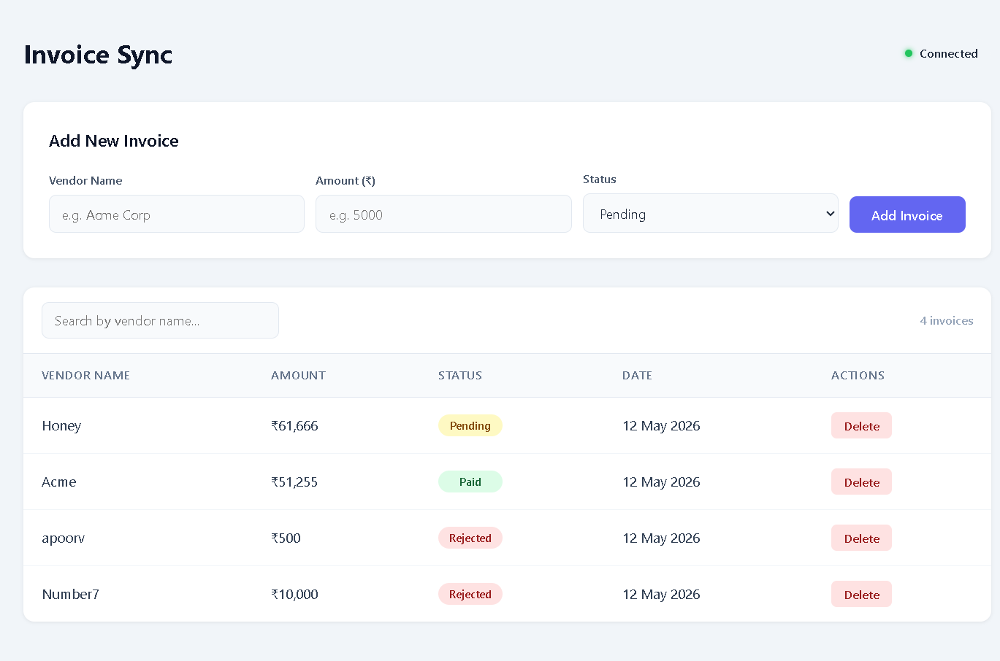
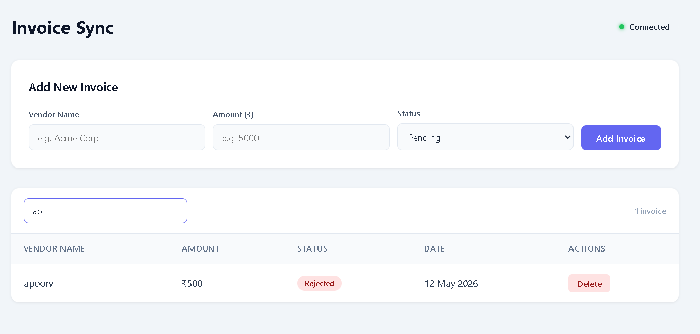
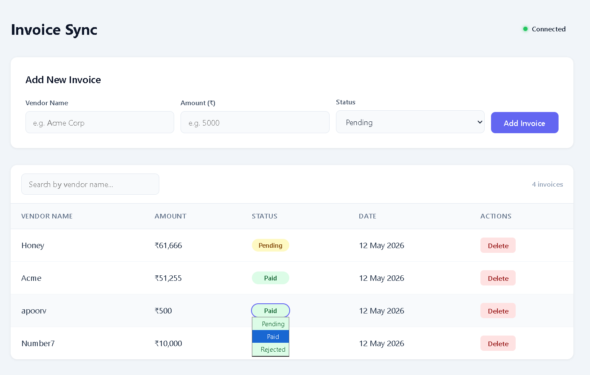

# InvoiceSync ⚡

A full-stack real-time invoice management dashboard. When a new invoice is added, updated, or deleted — every connected client sees the change **instantly** without a page refresh, powered by WebSockets.

---

## 🔗 Links

- **Live Demo:** https://invoice-sync-frontend.vercel.app/
- **GitHub:** https://github.com/Apoorv0207/Invoice-Sync

---

## 📸 Screenshots

### Dashboard Overview
<!-- Add screenshot: screenshots/dashboard.png -->


### Search by Vendor Name
<!-- Add screenshot: screenshots/search.png -->


### Update Invoice Status
<!-- Add screenshot: screenshots/update-status.png -->



---

## ✨ Features

- 📡 **Real-Time Updates** — New invoices appear instantly on all connected browser tabs via Socket.io, no refresh needed
- ➕ **Add Invoices** — Submit invoices with vendor name, amount, and status via a clean form
- 🔄 **Update Status Inline** — Change invoice status (Pending → Paid → Rejected) directly from the table row; Real-time invoice status updates with password-protected authorization.
- 🗑️ **Delete Invoices** — Password-protected invoice deletion synchronized across all connected clients in real time.
- 🔍 **Search by Vendor** — Filter invoices by vendor name instantly on the frontend with no extra API call
- 🟢 **Connection Status** — Live indicator showing whether the WebSocket is Connected or Disconnected
- 💾 **Persistent Storage** — Data stored in MongoDB Atlas, survives server restarts
- 🎨 **Row Animation** — New rows flash with a highlight animation so users clearly see incoming real-time data
- 🔷 **TypeScript** — Fully typed on both frontend and backend

---

## 🛠 Tech Stack

| Layer | Technology |
|---|---|
| Frontend | React 19, TypeScript, Vite |
| Backend | Node.js, Express, TypeScript |
| Real-Time | Socket.io (server + client) |
| Database | MongoDB Atlas + Mongoose |
| Styling | Plain CSS with CSS custom properties |

---

## 📁 Folder Structure

```
InvoiceSync/
├── backend/
│   ├── src/
│   │   ├── index.ts              # Express + Socket.io server entry point
│   │   ├── db.ts                 # MongoDB Atlas connection via Mongoose
│   │   ├── invoice.model.ts      # Mongoose schema and model
│   │   ├── invoice.routes.ts     # All REST API routes (GET, POST, DELETE, PATCH)
│   │   └── invoice.types.ts      # TypeScript Invoice interface
│   ├── .env                      # Environment variables (not committed)
│   ├── package.json
│   └── tsconfig.json
│
├── frontend/
│   ├── src/
│   │   ├── components/
│   │   │   ├── AddInvoiceForm.tsx    # Form to create a new invoice
│   │   │   ├── ConnectionStatus.tsx  # Live WebSocket connection indicator
│   │   │   ├── InvoiceRow.tsx        # Single table row with status + delete
│   │   │   └── InvoiceTable.tsx      # Full table with search bar
│   │   ├── types/
│   │   │   └── invoice.ts            # Shared Invoice TypeScript interface
│   │   ├── App.tsx                   # Root component, state + socket listeners
│   │   ├── App.css                   # All component styles + animations
│   │   ├── index.css                 # Base reset styles
│   │   ├── main.tsx                  # React entry point
│   │   └── socket.ts                 # Socket.io client singleton
│   ├── package.json
│   └── tsconfig.json
│
├── screenshots/
│   ├── dashboard.png
│   ├── search.png
│   ├── update-status.png
│   └── delete.png
│
└── README.md
```

---

## 🔄 App Flow

```
User fills form → POST /api/invoices
                        ↓
                  Save to MongoDB
                        ↓
                  io.emit('invoice_added')
                        ↓
        ┌───────────────────────────────┐
        ↓                               ↓
   Tab 1 updates                   Tab 2 updates
   (row animates in)               (row animates in)
```

Same flow applies for status update (`invoice_updated`) and delete (`invoice_deleted`) — every connected client reflects the change instantly.

---

## 🔌 WebSocket / Socket.io Flow

| Event | Direction | Trigger | Payload |
|---|---|---|---|
| `invoice_added` | Server → All Clients | POST /api/invoices succeeds | Full invoice object |
| `invoice_updated` | Server → All Clients | PATCH /api/invoices/:id/status succeeds | Updated invoice object |
| `invoice_deleted` | Server → All Clients | DELETE /api/invoices/:id succeeds | Invoice `_id` string |
| `connect` | Client event | Socket connects to server | — |
| `disconnect` | Client event | Socket loses connection | — |

**Key detail:** The server uses `io.emit()` (not `socket.emit()`) so every connected client receives the event, not just the one who triggered it.

---

## 📡 API Endpoints

### `GET /api/invoices`
Returns all invoices sorted by newest first.

**Response `200`**
```json
[
  {
    "_id": "665f1a2b3c4d5e6f7a8b9c0d",
    "vendorName": "Acme Corp",
    "amount": 5000,
    "status": "pending",
    "createdAt": "2024-06-04T10:30:00.000Z"
  }
]
```

---

### `POST /api/invoices`
Creates a new invoice and broadcasts `invoice_added` to all clients.

**Request Body**
```json
{
  "vendorName": "Acme Corp",
  "amount": 5000,
  "status": "pending"
}
```

**Response `201`** — returns the created invoice object.

---

### `PATCH /api/invoices/:id/status`
Updates the status of an invoice and broadcasts `invoice_updated` to all clients.

**Request Body**
```json
{
  "status": "paid"
}
```

**Response `200`** — returns the updated invoice object.

---

### `DELETE /api/invoices/:id`
Deletes an invoice and broadcasts `invoice_deleted` to all clients.

**Response `200`**
```json
{
  "message": "Invoice deleted"
}
```

---

## 🗄 Database Schema

**Collection: `invoices`**

| Field | Type | Required | Default | Notes |
|---|---|---|---|---|
| `_id` | ObjectId | auto | — | MongoDB auto-generated |
| `vendorName` | String | Yes | — | Trimmed |
| `amount` | Number | Yes | — | Invoice amount |
| `status` | String | No | `"pending"` | Enum: pending, paid, rejected |
| `createdAt` | Date | auto | — | Added by Mongoose timestamps |
| `updatedAt` | Date | auto | — | Added by Mongoose timestamps |

---

## 🚀 Installation & Local Setup

### Prerequisites
- Node.js v18 or above
- A free [MongoDB Atlas](https://www.mongodb.com/cloud/atlas) account

### 1. Clone the repository
```bash
git clone https://github.com/Apoorv0207/Invoice-Sync.git
cd Invoice-Sync
```

### 2. Setup Backend
```bash
cd backend
npm install
```

Create a `.env` file inside the `backend` folder:
```env
PORT=5000
MONGODB_URI=mongodb+srv://<username>:<password>@<cluster>.mongodb.net/invoice-dashboard?retryWrites=true&w=majority
```

Replace `<username>`, `<password>`, and `<cluster>` with your MongoDB Atlas credentials.

Start the backend:
```bash
npm run dev
```

You should see:
```
MongoDB Atlas connected successfully
Server running on http://localhost:5000
```

### 3. Setup Frontend
Open a new terminal:
```bash
cd frontend
npm install
npm run dev
```

Frontend runs at:
```
http://localhost:5173
```

### 4. Open the app
Visit `http://localhost:5173` in your browser.
To test real-time — open the same URL in a **second browser tab** and add an invoice. Both tabs update instantly.

---

## 🧪 Testing the Real-Time Feature

1. Open `http://localhost:5173` in **two separate tabs**
2. Add an invoice from Tab 1
3. Watch Tab 2 update **instantly** with the animated highlight
4. Change status in Tab 1 — Tab 2 reflects it immediately
5. Delete from Tab 2 — Tab 1 removes it instantly

You can also trigger the POST directly via Postman:
```
POST http://localhost:5000/api/invoices
Content-Type: application/json

{
  "vendorName": "Test Vendor",
  "amount": 9999,
  "status": "paid"
}
```
Both browser tabs will update in real time even from a Postman request.

---

## 👤 Author

**Apoorv Gautam**
GitHub: [@Apoorv0207](https://github.com/Apoorv0207)
